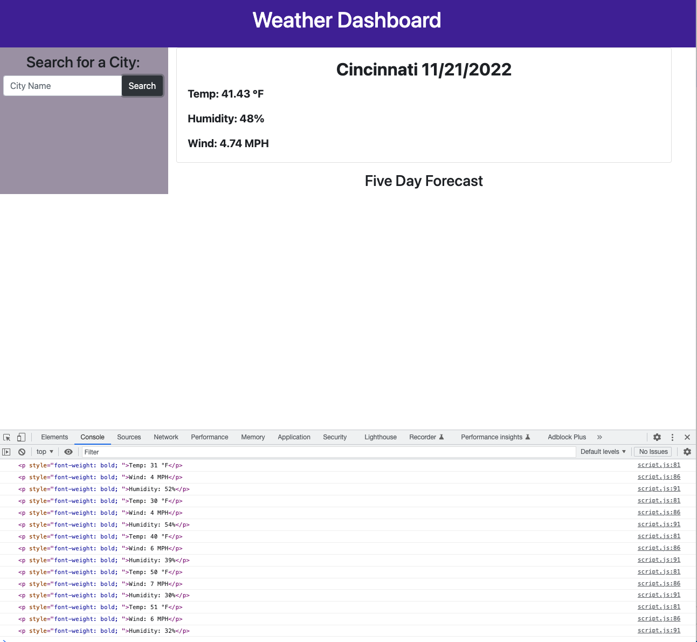

# Challenge Six - Weather Dashboard

## Description
This week's assignment was to build a weather dashboard from scratch that uses web apis and local storage to fetch and store information about searched weather conditions.

I struggled a lot with this project, as I missed class one day last week, didn't get a tutoring session in, and had an event going on on Friday night...the night I usually dedicate to these projects. I am turning this in incomplete, though I know that a lot of the logic is there and I could easily come back and resubmit at a later time.

The information for the five day forecast has been fetched (I even included console.logs to show that it is there), but I didn't get a chance to append them to the DOM. I also didn't get to storing anything, and really struggled with figuring out how to get the icons on the screen.

Despite being unable to complete this project, I did find everything I was able to do very fun and interesting. It shows just how much information you can attain through apis. I hope I will come back and complete it.

## Link
You can check out my application at https://carlihudson.github.io/weather-dashboard

## Usage
This application would be used to check current and future weather conditions for searched cities

## Credits
This week, I worked with my instructor, Jonathan Harvey, and TAs Shawn Littrel and Shazeen Fabius. 

